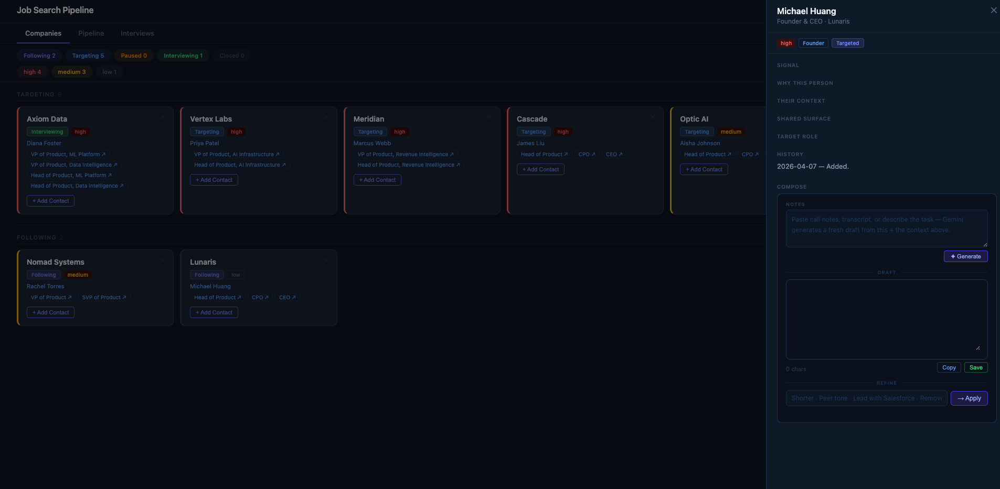

# Spillai

AI product leader. I build first-principles tools at the intersection of AI, quantitative finance, and real estate — prioritizing structural integrity and long-term ROI over quick fixes.

---

<table width="100%">
  <tr>
    <td width="33%" align="center"></td>
    <td width="33%" align="center"></td>
    <td width="34%" align="center"></td>
  </tr>
</table>

---

## Work
Product executive and 0→1 specialist with a decade of experience building and scaling enterprise-wide AI/ML data products. Landed a pivotal Revenue Risk & Retention Engine, transforming it from a niche tool to an intelligence platform covering $40B in revenue. Proven leader in bridging business strategy (P&L, NRR), data science (ML/LLM), and scalable systems architecture to drive $XXXM in business value.

## How I Build

- **Route by task complexity** — long-context models for architecture reasoning, fast/cheap models for pattern completion
- **Knowledge graph as executable context** — a living `lat.md` maps service relationships and business logic; relevant sections inject dynamically into every prompt
- **Agents with hands** — tool-calling over AST parsing, targeted file reads, and terminal output; the agent reads the error, runs the grep, proposes the fix
- **Three-tier evals** — deterministic tests, heuristic linting, and LLM-as-Judge against the style guide
- **Style is not promptable** — opinionated design systems and strict component libraries force the AI to build with your blocks, not invent its own
- **Feedback loop under 10 seconds** — Idea → Prompt → Render → Critique; anything slower kills the workflow

→ [Full framework: How I Build with AI](PHILOSOPHY.md)

---

## Projects

### Real Estate

**Real Estate Investment Analysis Platform**
Automated market analysis on Zillow's ZHVI dataset. Statistical clustering and trend analysis rank zip codes across a four-tier city system, producing a prioritized investment shortlist with automated email reporting.
`Python` `pandas` `statsmodels` `SQLite/PostgreSQL` `Tableau`

**Real Estate Partnership Portfolio Dashboard**
Single-page dashboard for a 7-partner investment partnership. A 20-year projection engine models equity contributions, ARV-based acquisitions, rental income, debt paydown, and reinvestment cycles — with real-time parameter sliders.
`React` `Vite` `Recharts` `JavaScript`

**Investment Dashboard Applications**
Plotly-based dashboards for real estate and equity portfolios. Real estate view includes map-based filtering by strategy (BRRRR, Fix & Flip, STR, LTH) with percentile rankings across key investment metrics.
`Python` `Taipy` `Plotly`

---

### Quantitative & Personal Finance

**Quantitative Stock Trading System**
End-to-end pipeline: value screener → 20+ technical indicators → walk-forward backtesting across 1,000+ strategy combinations per ticker → live paper trading via Alpaca. Includes Telegram alerts and idempotent order logic.
`Python` `Alpaca API` `PostgreSQL` `SQLAlchemy` `Telegram`

**Multi-Agent Qualitative Stock Research**
LLM-powered research framework using Google Gemini to evaluate companies across competitive positioning, management quality, and industry dynamics. Stores responses with confidence scores and versioned history. Designed to scale into a full multi-agent pipeline: fundamentals, technicals, news synthesis, Bull vs. Bear debate.
`Python` `Google Gemini` `PostgreSQL` `Alembic` `Click`

**Scenario-Based Retirement Calculator**
Models net worth to age 100 from a YAML-defined personal balance sheet. Supports discrete scenario toggles (equity liquidation, real estate exits, 529 superfunding, mortgage payoff), Monte Carlo simulation over 1,000 iterations, and strategy presets.
`Python` `Streamlit` `Plotly` `Monte Carlo`

---

### Interview Prep

**Job Search & Interview Funnel**
<add text here>

**AI-Powered PM Interview Evaluator**
Structured rubric-driven evaluation framework for PM interviews, spanning APM through VP PM. Loads role-level criteria, scores candidate responses, and generates calibrated feedback with level assessments using GPT and Gemini.
`Python` `OpenAI` `Google Gemini`

---

### Other

**Productivity: Google Calendar Aggregation & Notifications**
Lightweight OAuth2 utility that aggregates Google Calendar events and routes alerts through Telegram. Built as a reusable foundation for calendar-driven automation workflows.
`Python` `Google Calendar API` `Telegram`

**Automotive Depreciation & Cost-of-Ownership Analysis**
Analysis of a 100+ attribute vehicle dataset combining engine specs, fuel economy, pricing, and reviews. Depreciation curves and brand prestige rankings surface true cost-of-ownership trade-offs across makes and models.
`Python` `Tableau`

---

*Last updated: April 2026*
