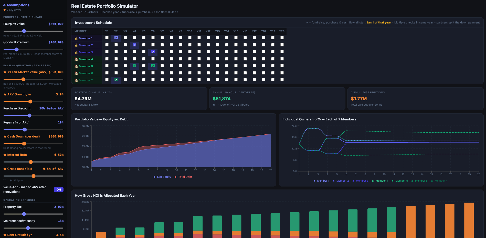
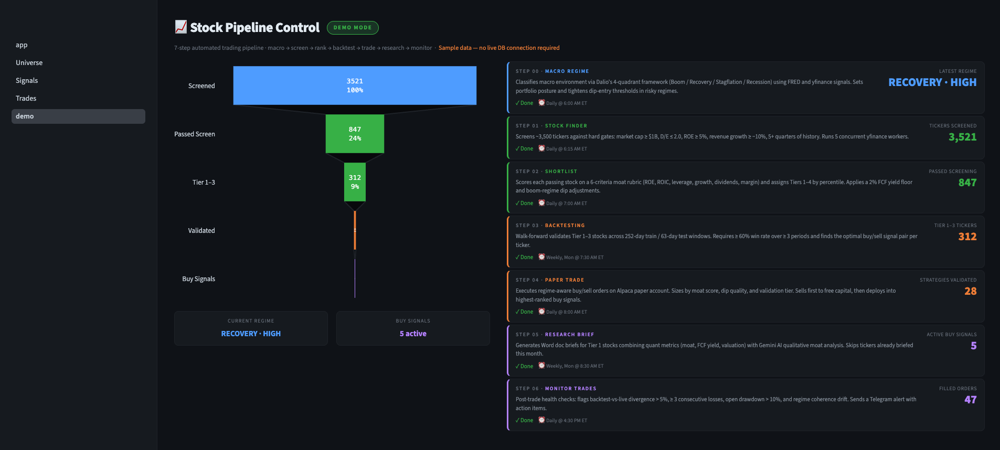
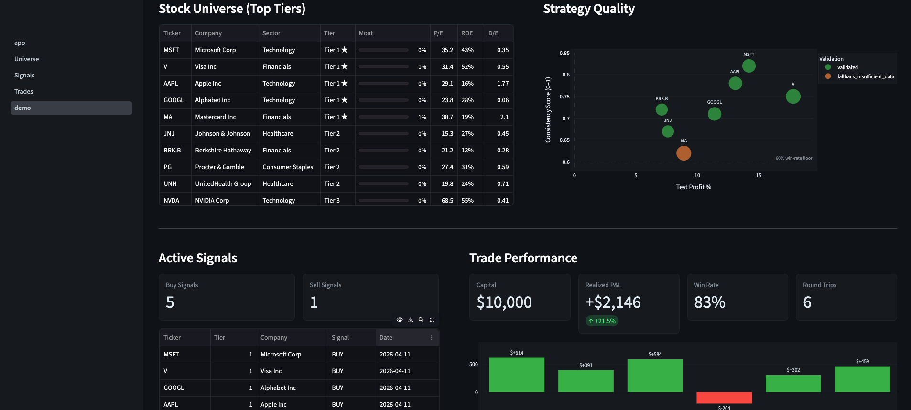
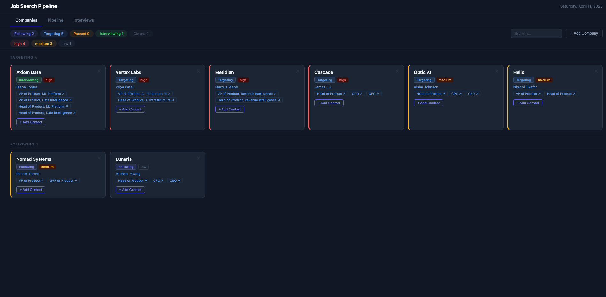
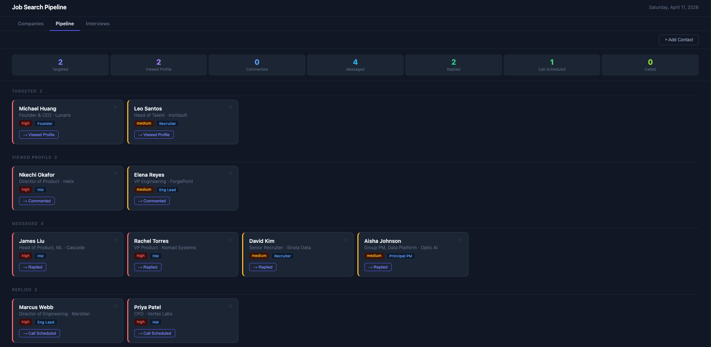

# Spillai

AI product leader with a decade building enterprise AI/ML products — bridging business strategy, data science, and systems architecture to drive measurable outcomes. I build personal tools at the intersection of AI and finance to pressure-test my mental models and stay sharp on where AI adds leverage and where it breaks down.

---

## What I Build & Why

Most tools are built around what's easy to build. I start from what's hard to decide.

The right question isn't "what can AI do?" It's "where is someone making an important decision badly — with incomplete information, no process, or a workaround they've stopped questioning?"

**Look for where people are stuck, not where they're asking for help.** Real problems rarely announce themselves. They show up as things everyone accepts — a spreadsheet doing the job of a system, a manual process that grows with headcount instead of automating it. The tool that should exist doesn't, because no one stopped to ask why the workaround exists.

**Every output should enable a decision.** Not a dashboard. Not a report. A decision: buy or pass, apply or skip, hold or restructure. If someone reads the output and still doesn't know what to do next, the tool isn't finished.

**Each project builds the judgment I bring to the next one.** Building a stock screener forces you to define what "good" looks like quantitatively. A retirement model forces you to make your assumptions about risk explicit. That accumulated understanding — of domains, tradeoffs, and where AI helps vs. misleads — is what sharpens the next product decision. The output is tools. The real product is better judgment.

AI removes the cost of building. What it can't replace is knowing which problem is worth solving.

→ [Full framework: How I Build with AI](PHILOSOPHY.md)

---

## Projects

### Real Estate

**Real Estate Investment Analysis Platform**
Ranks zip codes across a four-tier city system using statistical clustering on Zillow's ZHVI dataset, producing a prioritized investment shortlist with automated email reporting.
`Python` `pandas` `statsmodels` `SQLite/PostgreSQL` `Tableau`

**Real Estate Partnership Portfolio Dashboard**
20-year projection engine for a 7-partner investment partnership — models equity contributions, ARV acquisitions, rental income, debt paydown, and reinvestment cycles with real-time sliders.
`React` `Vite` `Recharts` `JavaScript`

<table width="100%">
  <tr>
    <td align="center"></td>
  </tr>
</table>

---

### Quantitative & Personal Finance

**Quantitative Stock Trading System**
End-to-end pipeline: value screener → 20+ technical indicators → walk-forward backtesting across 1,000+ strategy combinations → live paper trading via Alpaca with Telegram alerts.
`Python` `Alpaca API` `PostgreSQL` `SQLAlchemy` `Telegram`

**Multi-Agent Qualitative Stock Research**
LLM-powered research framework evaluating companies across competitive positioning, management quality, and industry dynamics — designed to scale into a full multi-agent pipeline with Bull vs. Bear debate.
`Python` `Google Gemini` `PostgreSQL` `Alembic` `Click`

**Scenario-Based Retirement Calculator**
Models net worth to age 100 from a YAML-defined balance sheet. Supports discrete scenario toggles, Monte Carlo simulation over 1,000 iterations, and strategy presets.
`Python` `Streamlit` `Plotly` `Monte Carlo`

<table width="100%">
  <tr>
    <td width="50%" align="center"></td>
    <td width="50%" align="center"></td>
  </tr>
</table>

---

### Interview Prep

**Job Search & Interview Funnel**
End-to-end pipeline for tracking job applications, managing interview stages, and surfacing conversion patterns across the funnel.

**AI-Powered PM Interview Evaluator**
Rubric-driven evaluation framework for PM interviews spanning APM through VP PM. Scores responses and generates calibrated feedback with level assessments using GPT and Gemini.
`Python` `OpenAI` `Google Gemini`

<table width="100%">
  <tr>
    <td width="50%" align="center"></td>
    <td width="50%" align="center"></td>
  </tr>
</table>

---

### Other

**Productivity: Google Calendar Aggregation & Notifications**
OAuth2 utility that aggregates Google Calendar events and routes alerts through Telegram. Built as a reusable foundation for calendar-driven automation.
`Python` `Google Calendar API` `Telegram`

**Automotive Depreciation & Cost-of-Ownership Analysis**
Depreciation curves and brand prestige rankings across a 100+ attribute vehicle dataset, surfacing true cost-of-ownership trade-offs.
`Python` `Tableau`

---

*Last updated: April 2026*
